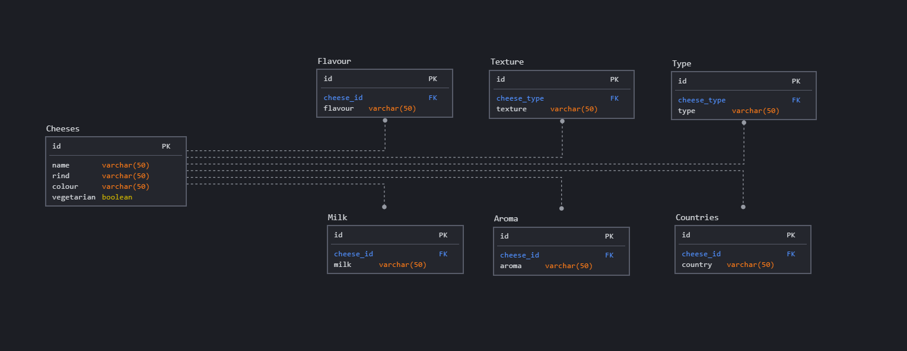

# py-cheesi

## Overview

Py-cheesi is a RESTful API created using Flask and BeautifulSoup4 to scrape data on the various cheeses listed on [cheese.com](https://cheese.com/)

There are a lot of open-source APIs on wine, but I noticed that there were no APIs that covered cheese. I wanted to focus my efforts on a using a unique set of data to practice creating python based APIs and setting up PostgreSQL databases.

## Table of Contents

- [py-cheesi](#py-cheesi)
  - [Overview](#overview)
  - [Table of Contents](#table-of-contents)
  - [Techincal Requirements](#techincal-requirements)
    - [Technologies Used](#technologies-used)
    - [Dependencies](#dependencies)
    - [Authentication](#authentication)
  - [Resource List](#resource-list)
    - [Cheese](#cheese)
      - [GET Cheese by ID](#get-cheese-by-id)
    - [Milk](#milk)
    - [Texture](#texture)
      - [GET by ID](#get-by-id)
    - [Aroma](#aroma)
      - [GET by ID](#get-by-id-1)
  - [Additional Notes](#additional-notes)

## Techincal Requirements

### Technologies Used

1. Python - the language that the project and API are written in
2. PostgreSQL - the local database that houses the data scraped for the database

### Dependencies

1. psycopg2-binary - to connect with the PostgreSQL database
2. requests - to get the raw HTML
3. BeautifulSoup4 - to parse through the HTML and scrape the data
4. Flask - to set-up the routes to connect to my API
5. Alembic - used to manage migrations of the SQL database

### Authentication

As of the most current release of this API, there is no authentication required to access the API. In future iterations of the API only administators will be allowed to make POST, PUT, and DELETE requests to preserve the integreity of the database.

## Resource List



Theere are currently currently two principal tables in the First Family API: the presidents themselves and the First Spouses.

The root directory for each collection provides a JSON containing all of the entries in the database. Below are examples of the HTTP requests that you can send into the API along with the output you may expect to recieve.

| **Route name** | **URL**           | **HTTP Verb** | **Description**                                                |
| -------------- | ----------------- | ------------- | -------------------------------------------------------------- |
| Index          | /{resource}       | GET           | Display a list of all the entries in the requested table |
| Show ID        | /{resource}/{:id} | GET           | Display a specific entry based on their ID |
| Create         | /{resource}       | POST          | Add new entry to the database              |
| Edit By Id     | /{resource}/{:id} | PUT           | Update a particular entry                  |
| Delete         | /{resource}/{:id} | DELETE        | Delete a particular entry                  |

Our goal is to have POST requests handled automatically by the web-scraper. PUT and DELETE functionallity will be avaialbe to admins only in case there is an error in the underlying data that needs to be corrected.
### Cheese

Basic characteristics for each cheese listed. Each of the included characteristics are singuler. For example, a cheese can only have one color (combinations are considered unique) and one type of rind.

| **Variable** | **Type**    | **Description**                                                                         |
| ------------ | ----------- | --------------------------------------------------------------------------------------- |
| `id`         | Primary Key | Key to the Milk collection, corresponds to the alphanumeric order of all of the cheeses |
| `rind`       | String      | type of rind (or casing) of the cheese                                                  |
| `colour`     | String      | Array of references to the president's previous partners                                |
| `vegetarian` | String      | Whether the cheese is vegetarian or not (the default is True)                           |

#### GET Cheese by ID

```JSON
{
    "colour": "yellow",
    "id": 1,
    "name": "abbaye de belloc",
    "rind": "natural",
    "vegetarian": true
}
```

### Milk

Charactersitics on the type of milk used to create a particular type of cheese. Some cheeses can be made using multiple types of milk. For example, Abbaye de Belloc can be created using unpasturized cow's or sheep's milk.

| **Variable** | **Type**    | **Description**                                                               |
| ------------ | ----------- | ----------------------------------------------------------------------------- |
| `id`         | Primary Key | Key to the Milk collection, corresponds to the first time each milk is listed |
| `cheese_id`  | Foreign Key | Foreign Key to the Cheese table                                               |
| `milk`       | String      | The type of milk used to create each cheese                                   |

### Texture


| **Variable** | **Type**    | **Description**                                                                     |
| ------------ | ----------- | ----------------------------------------------------------------------------------- |
| `id`         | Primary Key | Key to the Texture collection, corresponds to the first time each texture is listed |
| `cheese_id`  | Foreign Key | Foreign Key to the Cheese table                                                     |
| `texture`    | String      | The type of texture used to create each cheese                                      |

#### GET by ID

```JSON
 {
        "cheese_id": {
            "colour": "yellow",
            "id": 1,
            "name": "abbaye de belloc",
            "rind": "natural",
            "vegetarian": true
        },
        "id": 1,
        "texture": "creamy"
    }
```

### Aroma

| **Variable** | **Type**    | **Description**                                                                     |
| ------------ | ----------- | ----------------------------------------------------------------------------------- |
| `id`         | Primary Key | Key to the Aroma collection, corresponds to the first time each aroma is listed |
| `cheese_id`  | Foreign Key | Foreign Key to the Cheese table                                                     |
| `texture`    | String      | The type of aroma used to create each cheese                                      |

#### GET by ID

```JSON
 {
        "cheese_id": {
            "colour": "yellow",
            "id": 1,
            "name": "abbaye de belloc",
            "rind": "natural",
            "vegetarian": true
        },
        "id": 1,
        "texture": "lanoline"
    }
```

## Additional Notes

- All edits are first tested on the staging server then pushed to the final production version.